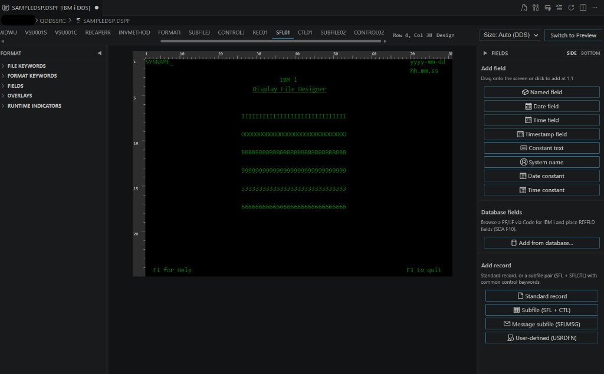

# IBM i DDS Designer
This is still a beta product. Please report any bugs/fixes/enhancement requests. 
Visual designer for IBM i display files (`.dspf`) and printer files (`.prtf`) —
a VS Code custom editor aimed at Rational Developer for i Screen Designer
workflows.



Published as **`mitchellfiedler.dds-designer`**.

This is a fork of the designer created by the
[Code for IBM i](https://github.com/codefori) team (Halcyon Tech Ltd and
contributors). The original project is
[codefori/vscode-ibmi-renderer](https://github.com/codefori/vscode-ibmi-renderer).
The parser, round-trip editor, and IBM i integration are their work; this
listing distributes a namespaced fork so it can be installed **alongside** the
Code for IBM i designer and the older IBM i Renderer.

Command ids, the custom editor view type (`mitchellfiedler.dspfDesigner`), and
webview layout storage are unique to this fork. Use **Open With → IBM i DDS
Designer** when both editors are installed.

---

## Contents

- [Install](#install)
- [Highlights](#highlights)
- [Requirements](#requirements)
- [Opening the designer](#opening-the-designer)
- [Works with the IBM i Development Pack](#works-with-the-ibm-i-development-pack)
- [Development](#development)
- [Testing](#testing)
- [Architecture](#architecture)
- [Contributing](#contributing)
- [Security](#security)
- [License](#license)

## Install

### VS Code Marketplace

Search for **IBM i DDS Designer** in the Extensions view, or install:

```text
ext install mitchellfiedler.dds-designer
```

Marketplace:
https://marketplace.visualstudio.com/items?itemName=mitchellfiedler.dds-designer

### Open VSX

https://open-vsx.org/extension/mitchellfiedler/dds-designer

### GitHub Release VSIX

1. Download `dds-designer.vsix` from the
   [latest GitHub Release](https://github.com/mitch123123/vscode-ibmi-renderer/releases).
2. In VS Code: **Extensions: Install from VSIX…** and select the file.

### From source

See [Development](#development) and [`CONTRIBUTING.md`](CONTRIBUTING.md).

## Highlights

- Custom text editor (`mitchellfiedler.dspfDesigner`) with full document sync + undo.
- Round-trip edits: `*` comments and blank lines outside the edited field are
  preserved byte-for-byte.
- Drag/drop field palette, multi-select, marquee selection, keyboard move,
  copy/paste.
- Rulers + row/column cursor badge; Design / Preview modes; DS3 (24×80) and
  DS4 (27×132) screen sizes.
- Indicator toggle panel with conditioned field/keyword preview.
- Windows (incl. `WDWTITLE`), subfiles (`SFL` + `SFLCTL`), overlays,
  `EDTCDE` / `EDTWRD` preview, reference fields.
- Printer file (`.prtf`) support.
- Add fields directly from a database file (SDA F10 equivalent) via
  Code for IBM i's `runSQL`.
- Remote disconnect / reconnect lifecycle: locks tabs sourced from IBM i when
  the connection drops.

## Requirements

- **VS Code** 1.97 or newer (trusted workspace required for the designer).
- Optional: **[Code for IBM i](https://marketplace.visualstudio.com/items?itemName=HalcyonTechLtd.code-for-ibmi)**
  — required only for editing remote `member`/`streamfile` DDS and for the
  database-field browser.
- Optional: **IBMi Languages** (`barrettotte.ibmi-languages`) — supplies the
  `dds.dspf` / `dds.prtf` language IDs used for CodeLens and command
  visibility.
- **Node.js 20** only if building from source.

## Opening the designer

Try the samples after install: [`samples/DEMO.dspf`](samples/DEMO.dspf) or
[`samples/SUBFILE.dspf`](samples/SUBFILE.dspf) (subfile + window).

- From a DDS text editor: the title-bar **Edit / Preview (IBM i DDS)** action, the
  **IBM i DDS Designer** CodeLens at the top of the file, or **Edit (IBM i DDS)** on
  a record-format line (opens this designer on that format).
- From Explorer, Object Browser, or IFS Browser: right-click →
  **Edit / Preview (IBM i DDS)**.
- Anywhere: **Open With… → IBM i DDS Designer**.
- The designer and the normal DDS text editor can stay open **side by side**.
  Both share the same `TextDocument`, so canvas edits update the text editor
  immediately and typing in source refreshes the designer (lightly debounced).
  Use the title-bar **Open DDS Source Beside** action (or Open With → Text
  Editor) while the designer is active.

The custom editor uses `priority: "option"`, so it does **not** steal the
default text editor for DDS sources.

## Works with the IBM i Development Pack

This extension is designed to sit alongside the
[IBM i Development Pack](https://marketplace.visualstudio.com/items?itemName=HalcyonTechLtd.ibm-i-development-pack):

| Extension | Relationship |
|-----------|--------------|
| **Code for IBM i** | Soft dependency. Remote `member` / `streamfile` URIs open and save through its FS providers. Disconnect/reconnect closes or locks remote designer tabs like other editors. |
| **IBMi Languages** (`barrettotte.ibmi-languages`) | Provides `dds.dspf` / `dds.prtf` language IDs and syntax highlighting. |
| **IBM i Renderer** (marketplace `vscode-displayfile`) | Older CodeLens preview still shipped in the pack. Both can stay installed; this fork uses **Edit / Preview (IBM i DDS)** / **Open With → IBM i DDS Designer**. |
| RPGLE / CL / COBOL / Db2 / Project Explorer / Testing | No shared APIs; no conflicts expected. |

## Development

```powershell
git clone https://github.com/mitch123123/vscode-ibmi-renderer.git
cd vscode-ibmi-renderer
npm ci
npm run compile
```

Press **F5** to launch the Extension Development Host, then open a sample DDS.

| Command                 | What it does                                          |
|-------------------------|-------------------------------------------------------|
| `npm run compile`       | Frontend copy → type-check → lint → esbuild bundle.   |
| `npm run watch`         | Frontend copy + esbuild watch for host and webview.   |
| `npm run check-types`   | `tsc --noEmit` only.                                  |
| `npm run lint`          | ESLint on `src`.                                      |
| `npm run package`       | Production build (same as compile with `--production`). |
| `npm run vsix`          | Package `dds-designer.vsix`.                          |
| `npm test`              | Vitest suite for the DDS model and host session.      |

The webview bundle is produced by `esbuild.js`; static vendor assets
(`@vscode-elements/elements`, `@vscode/codicons`, `konva`) are copied into
`webui/scripts/` by the `build:frontend` step.

## Testing

Model and session tests live under [`src/tests/`](src/tests/) and run under
Vitest:

```powershell
npm test
```

The DDS model in `src/ui/dspf.ts` is deliberately free of VS Code imports so
tests never load the extension host. New model features should ship with
Vitest coverage of both the happy path and one edge case (mid-span comments,
insert at EOF, referential integrity, etc.).

## Architecture

See [`docs/ARCHITECTURE.md`](docs/ARCHITECTURE.md) for:

- how the extension host and webview cooperate,
- the `DdsUpdate` insert-vs-replace convention,
- how comments and blank lines survive round-tripping,
- the remote disconnect / reconnect lifecycle,
- webview CSP / message validation trust boundary,
- and the database-field browser flow.

## Contributing

See [`CONTRIBUTING.md`](CONTRIBUTING.md) for setup, PR checklist, and the
maintainer release runbook. Please open an issue before large DDS contract
changes.

This project follows the [`CODE_OF_CONDUCT.md`](CODE_OF_CONDUCT.md).

## Security

See [`SECURITY.md`](SECURITY.md) for private vulnerability reporting.

## License

MIT — see [`LICENSE`](LICENSE) in this repository (copyright Halcyon Tech Ltd /
Code for IBM i contributors). The original license and copyright notice are
kept as required by MIT.
